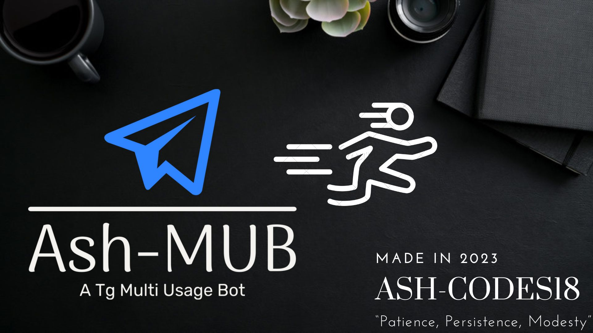

<br>
<br>
<p align="center"><strong>「 A Pyrogram based Telegram Bot with multiple features. Access the Live Demo at <a href="https://t.me/ash_utube_bot" target="_parent">Bot</a>」</strong></p>
<br>


## **💡 Features**

- Easy To Use With Bot Commands.
- Audio and Video Download support for YouTube and 2000 More Sites 😉
- Search Youtube and Spotify
- Download Songs
- Search Github
- Search Google, Bing, DuckDuckGo, Yandex and the entire web
- Search Images from Google, Bing, DuckDuckGo, Yandex and the entire web
- Search Unsplash and Pexels for images
- Search Pexels for Videos
- Search The Piratebay for Torrents.
- Get several category anime images
- Get image posts from reddit 
- And many more...🔥

## **🎓 Bot Setup**
To set up this bot, you need to provide your bot credentials, API keys, and other necessary details. Here are the steps:

1. Replace `api_id`, `api_hash`, and `bot_token` with your bot's credentials.
2. Replace `api_key` with your YouTube Data API v3 key.
3. Replace `client_id` and `client_secret` with your Spotify API credentials.
4. Replace `UNSPLASH_ACCESS_KEY` with your Unsplash API access key.
5. Replace `PEXELS_API_KEY` with your Pexels API key.
6. Replace `GAPI_KEY` with your Google Custom Search Engine API key.
7. Replace `SEARCH_ENGINE_ID`, `BING_ENGINE_ID`, `YANDEX_ENGINE_ID`, `DDG_ENGINE_ID`, and `WEB_ENGINE_ID` with your Google Custom Search Engine IDs.


### **🦉 Optional**

8. Add Subreddits of your choice for the `/reddit` and `/mreddit` commands
9. Replace `THEPIRATEBAY_URL` with any ThePirateBay URL of your choice or leave as is.
10. Specify count for number of media to send for and search and upload modules as per your requirement.


## **📝 How to Deploy?**

#### **🤖 Bot Commands To Set »**
```
start - To get the list of available commands 🧐.
ping - To check  if I am alive 📲.
general - to get the most used commands 💥.
anime - to get all anime related commands 📛.
browse - to get all web searching commands 🔓.
meme - to get a meme 😂.
reddit - to get something from reddit 💊.
manymeme- to get many memes 🤡.
mreddit - to fetch many things from reddit 🌈.
quote - to get an anime quote 👀.
mquote - to get many anime quotes 🧓.
```

__NOTE: Bot will work in both private and group chats, so Feel free to add the bot in groups!__

#### **⚙️ About The Credentials »**

- `API_ID` » <i>Your Telegram API ID, Can Be Found [Here.](https://my.telegram.org/auth)</i>
- `API_HASH` » <i>Your Telegram API HASH, Can Also Be Found [Here.](https://my.telegram.org/auth)</i>
- `BOT_TOKEN` » <i>Create a Telegram Bot From [Here](https://t.me/BotFather), Then Paste The Bot Token</i>


#### **💻 Local Machine »**
1. Open Terminal
2. Clone the repository by running the command 
```bash
git clone https://github.com/ash-codes18/Telegram-bot
```
3. Enter the directory by running `cd Telegram-bot`
4. Now, run the following command: `pip install -r requirements.txt`
5.  Fill in your details in a `main.py` file as given in the [Bot Setup](https://github.com/Ash-codes18/Telegram-bot#-bot-setup)
6. Run the bot using `python3 main.py`


#### **🟠 On Google Colab »**
<strong><em>C O M I N G   S O O N</strong></em>
<!-- 1. Open [Google Colab](https://colab.research.google.com/)
2. Upload the [main.ipynb](https://github.com/ash-codes18/Telegram-bot/blob/main/main.ipynb) file
3. Fill in your details in a `Colab fields` as given in the [Bot Setup](https://github.com/Ash-codes18/Telegram-bot#-bot-setup)
4. Run the bot using `python3 main.py` -->


## **🔥 Benefits**

- No need of VPS or RDP use locally or directly on Google Colab.
- Immersive Network speed in Google Servers
- Unlimited Storage in Telegram
- Upload Files of size up to 2000 MB


## **🚨 Usage**
To use this bot, simply start a chat with it and use the commands as described in the Start Message.

## **💗 Contributing**
Contributions are welcome! Please feel free to submit a pull request.

## ⚖️**License**
This bot is licensed under the MIT License.

## **🤙🏼 Connect With Me**

<a href="https://t.me/lemonizing" target="_parent"></a>


<br>

<h3 align="center">Please Leave a 🌟 If this repo Helped you</h4>